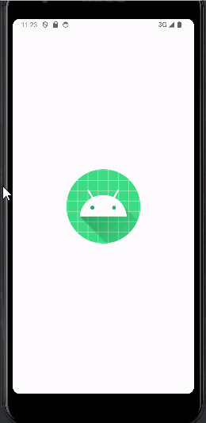

# Math Game

Math game where users can pick the difficulty, operations, question count they want. User score is displayed at the end with the option to start over.

## Functionality 

The following **required** functionality is completed:

* [ ] User can select a difficulty ranging from easy to hard. (easy = numbers < 10, medium = numbers < 25, hard = numbers < 50).
* [ ] User can select different operations for the questions (addition, multiplication, subtraction, division).
* [ ] SafeArgs is used to carry user input/data from fragment to fragment using a navigator for a seamless user experience.

NEW
* [ ] User can see their score after completion of the quiz
* [ ] User hears the correct sounds for each correct and incorrect answer.

The following **extensions** are implemented:

* SafeArgs
* Fragment
* NavController

## Video Walkthrough

Here's a walkthrough of the program:

GIF created with [LiceCap](http://www.cockos.com/licecap/).

## Notes

We had trouble with implementing SafeArgs and checking to see if it was the first time the app was run so no score would be shown on first run. Additionally, the sounds
and toasts took a bit of trouble but we were about to figure it out.

## License

    Copyright [2023] [Tip Browne, Ethan Deporter]

    Licensed under the Apache License, Version 2.0 (the "License");
    you may not use this file except in compliance with the License.
    You may obtain a copy of the License at

        http://www.apache.org/licenses/LICENSE-2.0

    Unless required by applicable law or agreed to in writing, software
    distributed under the License is distributed on an "AS IS" BASIS,
    WITHOUT WARRANTIES OR CONDITIONS OF ANY KIND, either express or implied.
    See the License for the specific language governing permissions and
    limitations under the License.
